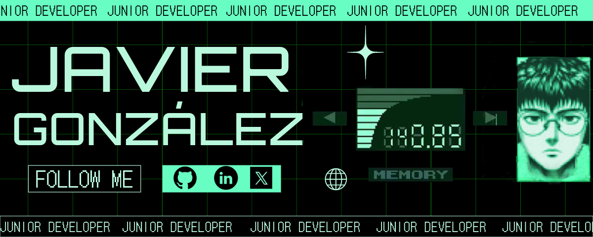

#  ¡Hola, soy Javier González! 👋

### Bienvenido a mi perfil de GitHub. 

---

## 🌐 Sobre mí
Recién egresado en el mundo del desarrollo de aplicaciones multiplataforma, estoy iniciando mi camino en la industria con una mente abierta y un fuerte deseo de aprender.

## 💻 Conocimientos Técnicos

| Categoría               | Tecnologías                                                                                                                                                             |
|-------------------------|-------------------------------------------------------------------------------------------------------------------------------------------------------------------------|
| **Lenguajes de Programación** |     |
| **Sistemas Operativos**      |                                                           |
| **Control de Versiones**     |                                                                                                                          |
| **Bases de Datos**           |                                                         |
| **Frameworks Frontend**      |                       |
| **Frameworks Backend**       |                                                                       |

## 📚 Educación
- Técnico Superior en Desarrollo de Aplicaciones Multiplataforma. 
   ***CPR CEBEM***, _2022-2024_

## 📞 Contacto
   [.svg.webp)](mailto:javigongimenez@gmail.com)

